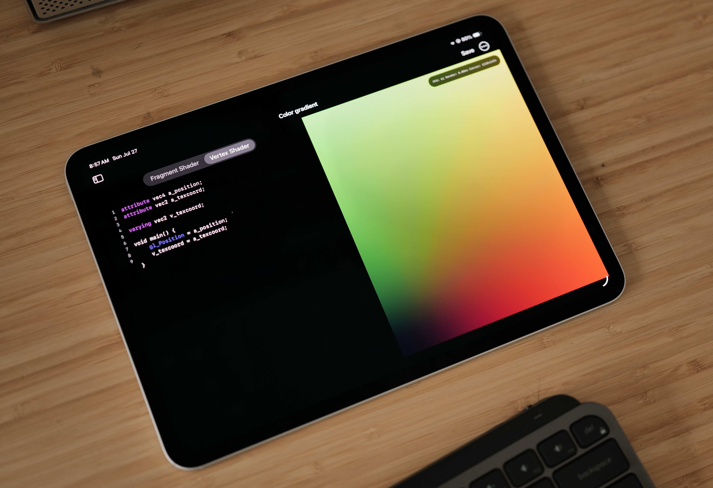

# GLSL Studio

GLSL Studio is a simple IDE allows you to write and preview glsl shader code. 

- Optimized for shader coding (set up for vertex, fragment)
- Build and manage multiple shader files
- Real time preview with auto save feature
- Basic syntax highlight support
- Export

GLSL Studio is built by [Claude code] (https://www.anthropic.com/claude-code)
